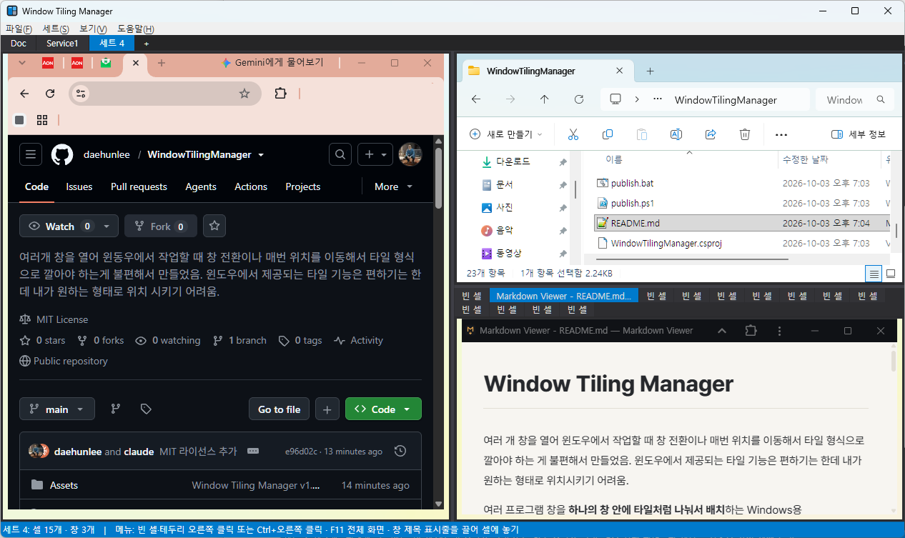

# Window Tiling Manager

여러 개 창을 열어 윈도우에서 작업할 때 창 전환이나 매번 위치를 이동해서 타일 형식으로 깔아야 하는 게 불편해서 만들었음.
윈도우에서 제공되는 타일 기능은 편하기는 한데 내가 원하는 형태로 위치시키기 어려움.

여러 프로그램 창을 **하나의 창 안에 타일처럼 나눠서 배치**하는 Windows용 프로그램입니다.



*한 세트를 셋으로 나눈 예: 왼쪽 브라우저, 오른쪽 위 탐색기, 오른쪽 아래 탭으로 묶은 문서 뷰어*

## 주요 기능

- 셀을 좌우/상하로 나누고 탭으로 묶기 (Ctrl+클릭으로 칸 수 지정)
- 실행 중인 창을 끌어다 셀에 놓아 배정, 셀 사이로 옮기기, 셀 밖으로 빼서 분리
- 같은 종류의 창(예: 모든 메모장)을 탭/좌우/상하로 한꺼번에 배치
- 여러 **세트**(작업 공간) 관리, 전체 화면(F11)과 화면 가장자리로 세트 전환
- 셀 최대화, 셀 여러 개 선택해서 닫기, 세트 초기화
- 레이아웃 자동 저장, 다시 시작하면 실행 중인 이전 창을 제자리로 다시 붙이기
- 다국어: 한국어 · English · 日本語 · 中文 (언어 파일을 추가해 다른 언어도 지원)

## 메뉴

모든 조작은 셀의 컨텍스트 메뉴로 합니다. 빈 셀은 오른쪽 클릭, 창이 들어 있는 셀은 테두리를 오른쪽 클릭하거나 **Ctrl + 오른쪽 클릭**하세요.


화면 각 부분에 대한 설명은 [사용법.md의 화면 구성](사용법.md#3-화면-구성)을 참고하세요.

## 다운로드 (바로 사용)

1. [**Releases**](https://github.com/daehunlee/WindowTilingManager/releases/latest)에서 `WindowTilingManager-<버전>-win-x64.zip`을 내려받습니다.
2. 압축을 풀고 `WindowTilingManager.exe`를 실행합니다. **.NET을 따로 설치할 필요가 없습니다.**

> 처음 실행할 때 "Windows의 PC 보호" 창이 뜨면 **추가 정보 → 실행**을 누르세요.
> 코드 서명이 없는 프로그램이라 나오는 안내입니다.

Windows 10 / 11 (64비트)에서 동작합니다.

## 소스에서 빌드

[.NET 9 SDK](https://dotnet.microsoft.com/download/dotnet/9.0) (Windows)가 필요합니다.

```powershell
dotnet run                 # 바로 실행
publish.bat                # release 폴더에 배포용 exe 와 zip 만들기
```

### 새 버전 배포 (관리자용)

1. `WindowTilingManager.csproj`의 `<Version>`을 올리고 커밋합니다.
2. 같은 번호로 태그를 만들어 올립니다.
   ```
   git tag v1.6.0
   git push origin v1.6.0
   ```
3. GitHub Actions가 자동으로 빌드해서 Releases에 zip을 올립니다 (몇 분 걸림).

자세한 사용법은 [사용법.md](사용법.md)를 참고하세요.

## 언어 / Languages

**보기 → 언어 (Language)** 에서 한국어, English, 日本語, 中文 중에 고를 수 있습니다.
다른 언어는 `Languages/en.json`을 복사해 번역한 파일(예: `fr.json`)을 실행 파일 옆 `Languages` 폴더에 넣으면 추가됩니다. 자세한 방법은 [사용법.md](사용법.md#11-언어-다국어)를 참고하세요.

Choose a display language in **View → Language** (Korean, English, Japanese, Chinese).
To add another language, copy `Languages/en.json` to `<code>.json` (e.g. `fr.json`), translate the values, and put it in the `Languages` folder next to the executable.

## 라이선스

[MIT License](LICENSE)
