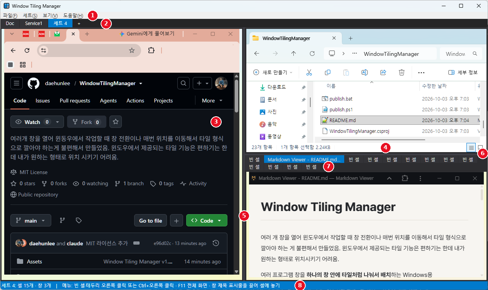
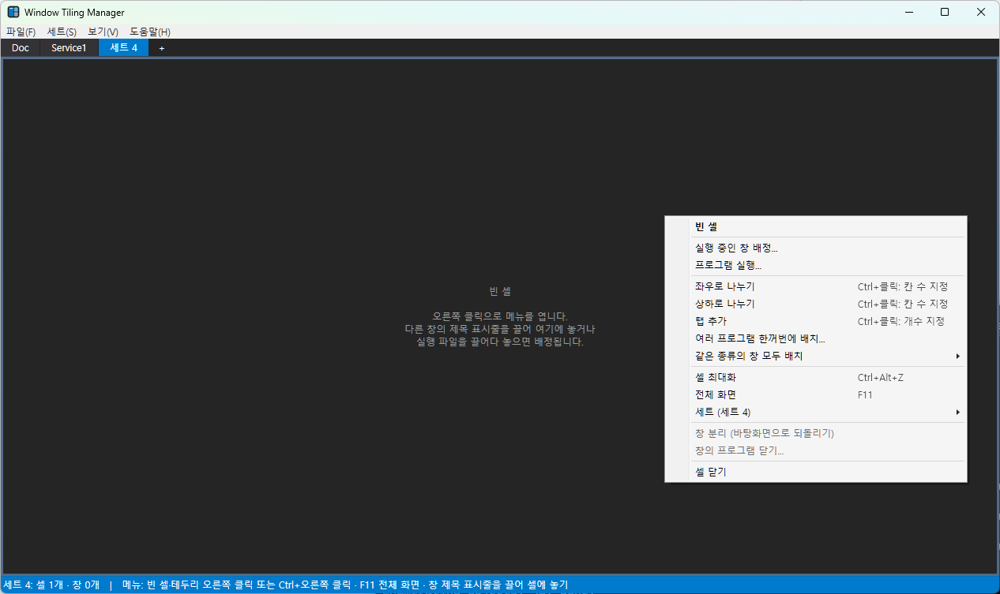

# Window Tiling Manager 사용법 (v1.5)

Window Tiling Manager는 여러 프로그램 창을 **하나의 창 안에 타일처럼 나눠서 배치**하는 Windows용 프로그램입니다.
화면을 좌우나 상하로 나누거나 탭으로 묶고, 각 칸(셀)에 메모장, 브라우저, 터미널 같은 다른 프로그램의 창을 넣어 사용합니다.
이렇게 나눈 배치를 **세트** 여러 개로 만들어 두고 전환할 수 있습니다.

---

## 1. 설치 (다운로드해서 바로 사용)

1. https://github.com/daehunlee/WindowTilingManager/releases/latest 에서 `WindowTilingManager-<버전>-win-x64.zip`을 내려받습니다.
2. 원하는 폴더에 압축을 풀고 `WindowTilingManager.exe`를 실행합니다.
   - .NET을 따로 설치할 필요가 없습니다 (프로그램 안에 포함).
   - 처음 실행할 때 "Windows의 PC 보호" 창이 뜨면 **추가 정보 → 실행**을 누르세요. 코드 서명이 없는 프로그램이라 나오는 안내입니다.
3. 설정과 레이아웃은 `%AppData%\WindowTilingManager\layouts.json`에 저장되므로, 새 버전으로 바꿀 때는 exe만 덮어쓰면 됩니다.

| 항목 | 내용 |
|---|---|
| 운영체제 | Windows 10 / 11 (64비트) |

---

## 2. 소스에서 빌드 (개발자용)

[.NET 9 SDK](https://dotnet.microsoft.com/download/dotnet/9.0) (Windows) 또는 Visual Studio 2022 17.12 이상(".NET 데스크톱 개발" 워크로드)이 필요합니다.

```powershell
cd D:\work\WindowTilingManager
dotnet run                 # 빌드하고 바로 실행
dotnet build -c Release    # 실행 파일만 만들기 (.NET 9 런타임 필요)
```

### 배포용 실행 파일 만들기 (release 폴더)

폴더의 **`publish.bat`**를 더블클릭하거나 명령 프롬프트에서 실행합니다.

```
release\WindowTilingManager\WindowTilingManager.exe        ← .NET 설치 없이 실행되는 exe 하나 (약 60~70MB)
release\WindowTilingManager-<버전>-win-x64.zip             ← 다른 사람에게 줄 배포용 압축 파일
```

`release` 폴더는 Git에 올라가지 않습니다(`.gitignore`). 다운로드는 GitHub Releases로 제공합니다.

### GitHub Releases에 새 버전 올리기

1. `WindowTilingManager.csproj`의 `<Version>`을 올리고 커밋, push 합니다.
2. 같은 번호의 태그를 만들어 올립니다.
   ```
   git tag v1.6.0
   git push origin v1.6.0
   ```
3. GitHub Actions(`.github/workflows/release.yml`)가 Windows에서 자동으로 빌드하여 **Releases**에 `WindowTilingManager-1.6.0-win-x64.zip`을 올립니다. 진행 상황은 저장소의 **Actions** 탭에서 볼 수 있습니다.
   - Actions 탭에서 **Run workflow**로 수동 실행하면 Releases에는 올리지 않고 빌드 결과만 Artifacts로 받을 수 있습니다.

> 폴더 안의 `WindowTilingManager\` 하위 폴더는 Visual Studio 템플릿이 만든 빈 프로젝트입니다. 빌드와 Git에서 제외되어 있으므로 지워도 됩니다.

---

## 3. 화면 구성

아래는 한 세트를 셋으로 나눠 왼쪽에 브라우저, 오른쪽 위에 탐색기, 오른쪽 아래에 탭으로 묶은 문서 뷰어를 넣은 예입니다.



| 번호 | 이름 | 설명 |
|:---:|---|---|
| ① | 메뉴 | 파일, 세트, 보기, 도움말. 전체 화면(F11)에서는 숨겨집니다 |
| ② | 세트 줄 | 세트 이름이 나열됩니다(예: `Doc`, `Service1`, `세트 4`). 클릭하면 전환, 더블클릭하면 이름 바꾸기, 오른쪽 클릭하면 세트 메뉴, **＋**는 새 세트 |
| ③ | 셀 (브라우저) | 창이 들어 있는 칸. 들어간 창은 제목 표시줄 없이 칸에 꼭 맞게 표시되고, 평소처럼 클릭하고 입력할 수 있습니다 |
| ④ | 셀 (탐색기) | 다른 셀. 셀마다 다른 프로그램을 넣을 수 있습니다 |
| ⑤ | 세로 구분선 | 끌어서 좌우 칸의 크기를 조절합니다 |
| ⑥ | 가로 구분선 | 끌어서 위아래 칸의 크기를 조절합니다 |
| ⑦ | 탭 줄 | 같은 자리를 여러 탭으로 나눠 씁니다. 파란 탭이 지금 보이는 탭입니다. 클릭하면 전환, 가운데 클릭하면 닫기, 오른쪽 클릭하면 메뉴 |
| ⑧ | 상태 표시줄 | 현재 세트 이름, 셀 수, 창 수와 간단한 조작 안내 |

셀에는 제목이나 버튼이 없습니다. **모든 조작은 셀의 컨텍스트 메뉴**로 합니다.

### 컨텍스트 메뉴를 여는 방법

| 셀 상태 | 방법 |
|---|---|
| 빈 셀 | 셀 안 아무 곳이나 **오른쪽 클릭** |
| 창이 들어 있는 셀 | 셀의 **테두리**(창 둘레의 얇은 띠, 마우스를 올리면 색이 바뀜)를 오른쪽 클릭 |
| 어떤 셀이든 | 셀 안 어디서든 **Ctrl + 오른쪽 클릭**. 창 안에서 그냥 오른쪽 클릭하면 그 프로그램의 메뉴가 나옵니다 |
| 탭 안의 셀 | 탭 머리글을 오른쪽 클릭 |

---

## 4. 셀 컨텍스트 메뉴

빈 셀을 오른쪽 클릭하면 아래와 같은 메뉴가 열립니다. 맨 위 굵은 글씨는 셀에 들어 있는 창의 제목입니다(빈 셀이면 "빈 셀"). 창이 없는 셀에서는 "창 분리"와 "창의 프로그램 닫기"가 흐리게 표시됩니다.



| 항목 | 설명 |
|---|---|
| *(맨 위 굵은 글씨)* | 셀에 들어 있는 창의 제목 |
| 실행 중인 창 배정... | 열려 있는 창 목록에서 골라 이 셀에 넣습니다 |
| 프로그램 실행... | 프로그램을 실행하고 그 창을 이 셀에 넣습니다 |
| 이전 프로그램 다시 실행 (xxx.exe) | 이 셀에 있었던 프로그램을 다시 실행해서 넣습니다. 빈 셀이고 기록이 있을 때만 보입니다 |
| 좌우로 나누기 / 상하로 나누기 | 셀을 둘로 나눕니다. 현재 창은 왼쪽(위쪽)에 남고 새 빈 셀이 생깁니다.<br>**Ctrl을 누른 채 클릭**하면 칸 수(2~16)를 물어보고 그 수만큼 **똑같은 크기로** 나눕니다 |
| 탭 추가 | 이 셀 자리에 새 탭을 하나 추가합니다.<br>**Ctrl을 누른 채 클릭**하면 추가할 탭 개수(1~20)를 물어봅니다 |
| 여러 프로그램 한꺼번에 배치... | 여러 창이나 프로그램을 골라 탭, 좌우, 상하 중 하나로 한 번에 배치합니다 (5장 방법 4) |
| 같은 종류의 창 모두 배치 ▸ | 실행 중인 창을 프로그램별로 보여 줍니다. 예: **notepad (3개) ▸ 좌우로 나란히**를 고르면 메모장 창 3개를 이 자리에 나란히 배치합니다 (5장 방법 5) |
| 셀 최대화 `Ctrl+Alt+Z` | 이 셀을 세트 전체 크기로 키웁니다. 다시 누르면 원래대로 돌아갑니다 |
| 전체 화면 `F11` | 메뉴, 세트 줄, 상태 표시줄, 창 테두리를 숨기고 화면 전체를 씁니다 |
| 세트 ▸ | 세트 전환, 새 세트, 이름 바꾸기, 삭제, 이전 프로그램 모두 실행 (6장 참고) |
| 창 분리 (바탕화면으로 되돌리기) | 셀의 창을 원래 모양(제목 표시줄, 크기, 위치)으로 바탕화면에 돌려놓습니다. 셀은 빈 셀로 남습니다 |
| 창의 프로그램 닫기... | 셀의 프로그램에 닫기 요청을 보냅니다. 저장하지 않은 내용이 있으면 그 프로그램이 확인 창을 띄웁니다 |
| 셀 닫기 / 탭 닫기 | 창을 바탕화면으로 돌려놓은 뒤 셀을 없앱니다. 옆 셀이 빈자리를 채웁니다 |
| 셀 여러 개 선택해서 닫기... | 현재 세트의 셀(탭 포함)을 목록에서 여러 개 골라 한 번에 닫습니다 (6장 참고) |
| 현재 세트 초기화... | 현재 세트를 빈 셀 하나로 되돌립니다 (6장 참고) |

---

## 5. 셀에 창 넣기

### 방법 1: 창을 끌어다 셀에 놓기 (가장 간단)

1. 바탕화면에 떠 있는 다른 프로그램 창의 **제목 표시줄을 잡고 끕니다**.
2. Window Tiling Manager의 셀 위로 가져가면 그 셀의 **테두리가 밝은 파란색**으로 바뀝니다.
3. 마우스 버튼을 놓으면 창이 그 셀에 들어갑니다.

- 이미 창이 있는 셀에 놓으면 기존 창은 바탕화면으로 돌아가고 새 창으로 바뀝니다.
- 창 가장자리를 잡고 **크기를 조절할 때**는 배정되지 않습니다.
- 다른 창이 Window Tiling Manager를 가리고 있는 위치에서는 배정되지 않습니다.
- 이 기능을 끄려면 **보기 → 창을 끌어다 셀에 놓으면 배정**의 체크를 해제하세요.

#### 셀에 들어 있는 창을 끌어서 옮기기

브라우저처럼 창 안에 끌 수 있는 영역(탭 줄 등)이 있는 프로그램은, 셀에 들어 있는 상태에서도 끌 수 있습니다.

| 놓은 위치 | 결과 |
|---|---|
| 다른 셀 위 | 그 셀로 **옮겨집니다**. 그 셀에 있던 창은 바탕화면으로 돌아갑니다 |
| Window Tiling Manager **바깥** | 그 자리에서 셀에서 **분리**되어 일반 창으로 돌아갑니다 |
| 원래 셀 또는 셀이 아닌 곳 | 원래 셀 위치로 **되돌아갑니다** |

### 방법 2: 실행 중인 창 배정

메뉴 → **실행 중인 창 배정...** 을 고르면 열려 있는 창 목록이 나타납니다. 검색 칸에 프로그램 이름이나 창 제목 일부를 입력해 목록을 좁힌 뒤, 원하는 창을 더블클릭하거나 **[배정]**을 누릅니다.

### 방법 3: 프로그램 실행

메뉴 → **프로그램 실행...** 에서 `.exe`, `.lnk`(바로 가기), `.bat` 파일을 고르면 프로그램을 실행한 뒤 새로 나타난 창을 자동으로 셀에 넣습니다. 창이 뜰 때까지 최대 20초 기다립니다.
탐색기에서 실행 파일이나 바로 가기를 **빈 셀 위로 끌어다 놓아도** 똑같이 동작합니다.

### 방법 4: 여러 프로그램 한꺼번에 배치

셀 메뉴 → **여러 프로그램 한꺼번에 배치...** 를 고르면 대화상자가 열립니다.

1. **배치 방법**을 고릅니다: **탭으로**, **좌우로 나란히**, **상하로 나란히**.
2. 목록에서 배치할 **실행 중인 창**에 체크합니다. 아직 실행하지 않은 프로그램은 **[실행 파일 추가...]**로 넣습니다. 여러 개를 한 번에 고를 수 있고, 추가한 항목은 자동으로 체크됩니다.
3. 항목을 선택하고 **▲ / ▼** 로 순서를 바꿀 수 있습니다. 목록 순서대로 왼쪽(위쪽, 첫 탭)부터 배치됩니다.
4. **[배치]**를 누릅니다.

- 지금 셀이 **비어 있으면** 첫 항목이 이 셀에 들어가고, 나머지 항목만큼 셀(탭)이 새로 생깁니다.
- 지금 셀에 **창이 있으면** 그 창은 그대로 두고, 항목 수만큼 셀(탭)을 새로 만들어 그 뒤에 배치합니다.
- 좌우·상하 배치는 모든 칸이 같은 크기로 나뉩니다.
- 새로 실행하는 프로그램은 창을 서로 가로채지 않도록 하나씩 차례대로 실행됩니다. 창을 찾지 못한 항목은 마지막에 알려 줍니다.
- **종류별 선택**: 대화상자 위쪽의 콤보 상자에서 프로그램(예: `notepad (3개)`)을 고르고 **[이 종류 모두 체크]**를 누르면, 그 프로그램의 창이 모두 체크됩니다. 다른 종류를 이어서 체크해 섞을 수도 있습니다. **[전체 해제]**로 체크를 모두 지웁니다.

### 방법 5: 같은 종류의 창 모두 배치 (가장 빠름)

셀 메뉴 → **같은 종류의 창 모두 배치 ▸** 에 지금 실행 중인 창이 프로그램별로 나옵니다.

```
같은 종류의 창 모두 배치 ▸ ┬ chrome   (2개) ▸
                            ├ notepad  (3개) ▸ ┬ 탭으로
                            └ WindowsTerminal (1개) ▸ ├ 좌우로 나란히
                                                      └ 상하로 나란히
```

- 고르는 즉시 그 프로그램의 창이 **모두** 이 셀 자리에 배치됩니다. 대화상자는 나오지 않습니다.
- 항목 위에 마우스를 올리면 포함되는 창 제목 목록이 보입니다.
- 이미 다른 셀에 들어 있는 창은 포함되지 않습니다.
- 배치 규칙(빈 셀이면 첫 창이 이 셀에 들어감, 칸 크기 균등)은 방법 4와 같습니다.

---

## 6. 세트 (여러 배치를 만들어 두고 전환)

세트는 독립된 타일 배치 하나입니다. 예를 들어 "개발" 세트에는 편집기, 브라우저, 터미널을, "문서 작업" 세트에는 워드와 PDF 뷰어를 넣어 두고 바꿔 가며 쓸 수 있습니다.

| 하고 싶은 일 | 방법 |
|---|---|
| 세트 전환 | 세트 줄의 이름을 클릭 · 메뉴 → 세트 · **Ctrl+Alt+1 ~ 9** |
| 새 세트 | 세트 줄의 **＋** · 메뉴 → 세트 → 새 세트 |
| 이름 바꾸기 | 세트 줄의 이름을 **더블클릭** · 메뉴 → 세트 → 현재 세트 이름 바꾸기 |
| 세트 삭제 | 메뉴 → 세트 → 현재 세트 삭제 (그 세트의 창은 바탕화면으로 돌아갑니다) |
| 세트 초기화 | 셀 메뉴 → 현재 세트 초기화 · 메뉴 → 세트 → 현재 세트 초기화 · 파일 → 현재 세트 초기화 |
| 셀 여러 개 닫기 | 셀 메뉴 → 셀 여러 개 선택해서 닫기 · 메뉴 → 세트 → 셀 여러 개 선택해서 닫기 · 파일 메뉴 |
| 세트 메뉴 바로 열기 | 세트 줄의 이름을 오른쪽 클릭 |

- 다른 세트로 전환해도 숨겨진 세트의 프로그램은 **종료되지 않고 계속 실행**됩니다. 다시 돌아오면 그대로 있습니다.
- 셀 컨텍스트 메뉴의 **세트 ▸** 하위 메뉴에서도 같은 일을 할 수 있습니다. 전체 화면일 때 편리합니다.

### 세트 초기화

세트를 처음 상태(빈 셀 하나)로 되돌립니다.

- 나눈 모양, 탭, 셀마다 기억하던 이전 프로그램 기록이 모두 지워집니다.
- 들어 있던 창은 **바탕화면으로 돌아가고 프로그램은 계속 실행**됩니다. 창까지 닫으려면 아래 "셀 여러 개 닫기"를 쓰세요.
- 실행하기 전에 셀 개수와 창 개수를 보여 주고 확인을 받습니다.
- 다른 세트에는 영향이 없습니다.

### 셀 여러 개 선택해서 닫기

현재 세트의 모든 셀(숨겨진 탭 안의 셀 포함)이 목록으로 나옵니다.

| 열 | 내용 |
|---|---|
| ☐ | 닫을 셀에 체크 |
| # | 셀 번호 |
| 위치 | 셀이 있는 곳. 예: `탭 2 › 왼쪽 › 위` (2번째 탭 안, 왼쪽 칸의 위쪽 셀) |
| 창 제목 | 들어 있는 창 제목, `(빈 셀)`, 또는 `(복원 대기 중) 이전 창 제목` |
| 프로그램 | 셀에 배정된(되었던) 프로그램 |

1. 닫을 셀에 체크합니다. **[모두 체크] [빈 셀만 체크] [창이 있는 셀만 체크] [모두 해제]** 버튼으로 빠르게 고를 수 있습니다.
2. 목록에서 줄을 클릭하면 그 셀의 **테두리가 파랗게** 표시되어 어느 셀인지 확인할 수 있습니다.
3. 창이 들어 있는 셀을 어떻게 할지 고릅니다.
   - **셀의 창은 바탕화면으로 되돌리기** (기본): 셀만 닫고 프로그램은 계속 실행됩니다.
   - **셀의 창도 닫기**: 창을 바탕화면으로 돌려놓은 뒤 각 프로그램에 닫기 요청을 보냅니다. 저장하지 않은 내용이 있으면 그 프로그램이 저장 여부를 묻습니다. 이 옵션을 고르면 한 번 더 확인을 받습니다.
4. **[선택한 셀 n개 닫기]**를 누릅니다.

- 닫힌 셀의 자리는 옆 셀이 채웁니다. 탭이 하나만 남으면 탭 묶음이 풀립니다.
- 모든 셀을 닫으면 빈 셀 하나만 남습니다(세트 초기화와 같음).

### 저장과 다음 실행 때의 복원

- 모든 세트의 **이름, 나눈 모양, 구분선 위치, 탭 구성**과 각 셀에 배정된 **프로그램 경로와 창 제목**이 저장됩니다.
  - 저장 시점: 종료할 때, 그리고 실행 중 1분마다 자동 저장 (갑자기 꺼져도 최근 상태가 남습니다)
  - 수동 저장: **파일 → 레이아웃 지금 저장**
  - 저장 위치: `%AppData%\WindowTilingManager\layouts.json`
- 다음에 실행하면 같은 모양으로 복원되고, 종료할 때 창이 들어 있던 셀에는 **이미 실행 중인 같은 프로그램의 창을 다시 붙입니다.**
  - Window Tiling Manager를 종료하면 붙어 있던 창은 바탕화면으로 돌아가 계속 실행됩니다. 그래서 다시 시작하면 그 창들이 그대로 제자리로 들어갑니다.
  - 같은 프로그램 창이 여러 개면 **창 제목이 같은 창**을 먼저 고릅니다.
  - **프로그램을 새로 실행하지는 않습니다.** 원하지 않는 프로그램이 저절로 실행되는 일을 막기 위해서입니다.
- 같은 프로그램 창이 실행 중이 아닌 셀은 **"복원 대기 중"**으로 비워 두고, 어떤 창이 있었는지 셀에 표시합니다. 다음 중 하나로 채우세요.
  - 그 프로그램을 직접 띄운 뒤 **파일 → 실행 중인 이전 창 다시 붙이기** (셀 메뉴 → 세트 ▸ 에도 있음)
  - 띄운 창을 끌어다 그 셀에 놓기
  - 셀 메뉴 → **이전 프로그램 다시 실행**: 그 셀 하나만, 직접 고른 경우에만 실행합니다
  - 메뉴 → 세트 → **현재 세트의 이전 프로그램 모두 실행...**: 실행할 프로그램 목록을 먼저 보여 주고, **확인을 눌러야** 실행합니다
- 시작할 때 다시 붙이는 것도 원하지 않으면 **파일 → 시작할 때 실행 중인 이전 창 다시 붙이기**의 체크를 해제하세요. 끄면 셀이 모두 "복원 대기 중"으로 남고, 필요할 때 위 메뉴로 직접 붙이면 됩니다.
- 브라우저 탭 내용, 문서 내용 같은 **프로그램 안의 상태는 각 프로그램이 복원**합니다. 예를 들어 Chrome에서 "시작할 때 계속 이어서"를 켜 두면 탭까지 그대로 돌아옵니다.

---

## 7. 전체 화면과 셀 최대화

| 기능 | 켜기/끄기 | 설명 |
|---|---|---|
| 전체 화면 | **F11** · 셀 메뉴 → 전체 화면 · 보기 → 전체 화면 | 메뉴, 세트 줄, 상태 표시줄, 창 테두리를 숨기고 모니터 전체(작업 표시줄 포함)를 씁니다 |
| 셀 최대화 | **Ctrl+Alt+Z** (마우스 아래 셀) · 셀 메뉴 → 셀 최대화 | 셀 하나를 세트 전체 크기로 키웁니다. 나머지 셀은 잠시 숨겨집니다 |

두 기능을 함께 쓰면 셀 하나를 모니터 전체 크기로 볼 수 있습니다.

### 전체 화면에서 세트 바꾸기

전체 화면에서는 세트 줄이 보이지 않으므로 다음 방법으로 세트를 바꿉니다.

| 방법 | 동작 |
|---|---|
| 마우스를 **화면 왼쪽 끝**에 잠깐(약 0.35초) 둠 | **이전 세트**로 전환 (첫 세트에서는 마지막 세트로) |
| 마우스를 **화면 오른쪽 끝**에 잠깐 둠 | **다음 세트**로 전환 (마지막 세트에서는 첫 세트로) |
| `Ctrl+Alt+1` ~ `9` | 해당 번호의 세트로 바로 전환 |
| 셀 메뉴 → 세트 ▸ | 목록에서 골라 전환 |

- 세트를 바꾸면 화면 위쪽 가운데에 **"2 / 3  세트 이름"** 같은 알림이 잠깐 나타납니다.
- 한 번 전환한 뒤 계속 넘기려면 마우스를 가장자리에서 조금 떼었다가 다시 가져가세요. 가장자리에 그대로 두면 계속 넘어가지 않습니다.
- 마우스 버튼을 누르고 있는 동안(끌기, 텍스트 선택 등)이나 다른 프로그램이 앞에 있을 때는 동작하지 않습니다.
- 끄려면 **보기 → 전체 화면에서 화면 왼쪽/오른쪽 끝으로 세트 전환**의 체크를 해제하세요.
- 모니터를 여러 대 쓰는 경우, 옆에 다른 모니터가 붙어 있는 쪽 가장자리에서는 마우스가 그 모니터로 넘어가서 동작하지 않을 수 있습니다.
최대화된 셀에서 나누기나 탭 추가를 하면 자동으로 최대화가 풀린 뒤 처리됩니다.

---

## 8. 단축키

Window Tiling Manager가 **활성 창일 때** 동작합니다. 셀 안의 프로그램에 입력 포커스가 있어도 동작합니다.

| 단축키 | 기능 |
|---|---|
| `F11` | 전체 화면 켜기/끄기 |
| `Ctrl+Alt+1` ~ `Ctrl+Alt+9` | 1~9번째 세트로 전환 |
| `Ctrl+Alt+Z` | 마우스 아래 셀 최대화 / 해제 |
| `Ctrl + 오른쪽 클릭` | 마우스 아래 셀의 컨텍스트 메뉴 |
| 화면 왼쪽/오른쪽 끝에 마우스 (전체 화면) | 이전/다음 세트 |
| 메뉴 항목 `Ctrl + 클릭` | 나누기: 칸 수 지정 · 탭 추가: 개수 지정 |

> Window Tiling Manager가 활성 상태일 때 F11은 이 프로그램의 전체 화면 전환에 쓰이므로, 셀 안 브라우저의 F11(브라우저 전체 화면)은 동작하지 않습니다.

---

## 9. 탭

- 셀 메뉴 → **탭 추가**를 고르면 그 자리가 탭 묶음이 되고 새 탭이 생깁니다.
- 탭 머리글을 **클릭**하면 전환, **가운데 클릭**하면 닫기, **오른쪽 클릭**하면 메뉴가 열립니다.
- 숨겨진 탭의 프로그램도 계속 실행 중입니다.
- 탭이 하나만 남으면 탭 묶음이 자동으로 풀립니다.

---

## 10. 메인 메뉴

| 메뉴 | 항목 | 설명 |
|---|---|---|
| 파일 | 레이아웃 지금 저장 | 현재 구성을 바로 저장합니다 (종료할 때와 1분마다 자동 저장) |
| 파일 | 시작할 때 실행 중인 이전 창 다시 붙이기 | 6장 참고 (기본: 켜짐, 프로그램을 새로 실행하지는 않음) |
| 파일 | 실행 중인 이전 창 다시 붙이기 | 복원 대기 셀에, 지금 실행 중인 같은 프로그램의 창을 붙입니다 |
| 파일 | 모든 창 분리 | 현재 세트의 모든 창을 바탕화면으로 돌려놓습니다. 나눈 모양은 유지됩니다 |
| 파일 | 셀 여러 개 선택해서 닫기... | 6장 참고 |
| 파일 | 현재 세트 초기화... | 현재 세트의 창을 모두 바탕화면으로 돌려놓고 빈 셀 하나로 만듭니다 (6장 참고) |
| 파일 | 종료 | 종료합니다. 모든 세트의 창이 자동으로 바탕화면으로 돌아갑니다 |
| 세트 | (세트 목록) ... | 6장 참고 |
| 보기 | 전체 화면 | F11과 같습니다 |
| 보기 | 항상 위에 표시 | 이 창을 다른 창보다 항상 위에 둡니다 |
| 보기 | 전체 화면에서 화면 왼쪽/오른쪽 끝으로 세트 전환 | 7장 참고 (기본: 켜짐) |
| 보기 | 창을 끌어다 셀에 놓으면 배정 | 5장 방법 1을 켜거나 끕니다 |

보기·파일 메뉴의 켜기/끄기 설정은 레이아웃과 함께 저장되어 다음 실행 때도 유지됩니다.
| 도움말 | 사용법 | 간단한 사용법을 보여 줍니다 |

---

## 11. 알아 두어야 할 제한사항

이 프로그램은 다른 프로그램의 창을 **Window Tiling Manager가 소유한 창으로 바꾸고, 셀 위치에 정확히 겹쳐 놓는 방식**으로 동작합니다.
붙어 있는 창도 원래대로 독립된 창이라서 키보드 입력, 브라우저, 단축키가 평소처럼 동작하고, 분리하면 완전히 원래 상태로 돌아갑니다.
다만 프로그램에 따라 다음과 같은 제약이 있습니다.

| 상황 | 내용 / 대처 |
|---|---|
| **관리자 권한으로 실행된 창** | 일반 권한의 Window Tiling Manager는 가져올 수 없습니다("액세스 거부"). 이 프로그램도 **관리자 권한으로 실행**하세요. 단축키와 끌어다 놓기도 관리자 권한 창 위에서는 동작하지 않습니다. |
| **UWP / 스토어 앱** (계산기, 설정 등) | 목록에 나오지 않거나, 붙여도 제대로 그려지지 않을 수 있습니다. |
| **Windows 11 메모장, 터미널 등** | 실행 파일과 실제로 창을 띄우는 프로세스가 다릅니다. **프로그램 실행**은 새로 나타난 창을 찾아 붙이므로 대부분 동작하지만, 안 되면 창을 끌어다 셀에 놓으세요. |
| **이미 실행 중인 브라우저 등 단일 인스턴스 앱** | 다시 실행해도 새 창이 아니라 기존 창에 탭만 추가될 수 있습니다. 이때는 창을 끌어다 놓거나 **실행 중인 창 배정**을 사용하세요. |
| **스스로 창을 옮기거나 최대화·최소화하는 프로그램** | 0.25초 안에 셀 위치와 크기로 자동으로 되돌아갑니다. |
| **메인 창을 끌어 옮길 때** | 셀에 붙은 창이 아주 잠깐 늦게 따라올 수 있습니다. |
| **배정된 프로그램 종료** | 곧바로 셀이 자동으로 빈 셀로 바뀝니다. 프로그램 경로는 남아 있어 다시 실행할 수 있습니다. |
| **고DPI / 여러 모니터** | DPI 설정이 다른 모니터 사이에서는 글자 크기나 끌어다 놓는 위치 판정이 조금 어긋날 수 있습니다. |
| **보안 프로그램 경고** | 단축키와 Ctrl+오른쪽 클릭을 위해 키보드·마우스 훅을 사용하므로, 일부 보안 프로그램이 경고를 띄울 수 있습니다. 훅이 막혀도 나머지 기능은 동작합니다. |

### 안전 장치

- **정상 종료**(창 닫기, 파일 → 종료)하면 모든 세트의 창이 원래 모양과 위치로 **바탕화면에 돌아갑니다**.
- 작업 관리자로 강제 종료하는 등 **비정상 종료**를 하면 붙어 있던 창이 제목 표시줄 없는 상태로 남거나 함께 닫힐 수 있습니다. 저장하지 않은 작업이 있는 창은 먼저 저장해 두세요.
- 프로그램 내부 오류가 나면 오류 메시지만 표시하고 계속 실행되므로, 붙어 있던 창을 잃지 않습니다.

---

## 12. 프로젝트 구조

```
WindowTilingManager/
├─ WindowTilingManager.csproj    프로젝트 파일 (.NET 9, WPF, 아이콘 설정)
├─ App.xaml / App.xaml.cs        앱 시작, 전역 오류 처리
├─ MainWindow.xaml / .cs         메인 창: 세트 관리, 전체 화면, 단축키, 창 끌어다 놓기, 저장/복원
├─ Assets/
│  ├─ app.ico                    애플리케이션 아이콘 (16~256px)
│  └─ app_preview.png            아이콘 미리보기
├─ Controls/
│  ├─ LayoutNode.cs              레이아웃 트리의 기본 클래스, 색상 테마
│  ├─ Workspace.cs               세트 하나 (레이아웃 트리 + 셀 최대화)
│  ├─ TilingRoot.cs              세트의 레이아웃 최상위 컨테이너
│  ├─ CellControl.cs             창 하나를 담는 셀 (테두리, 컨텍스트 메뉴, 배정/실행/해제)
│  ├─ SplitNode.cs               좌우/상하 분할 + 드래그 구분선
│  ├─ TabsNode.cs                탭 묶음
│  ├─ WindowHost.cs              외부 창 붙이기 (소유 창으로 전환, 셀 위치 맞춤, 숨김/표시, 복원, 감시)
│  ├─ WindowPickerDialog.cs      실행 중인 창 선택 대화상자
│  ├─ InputDialog.cs             이름·개수 입력 대화상자
│  ├─ MultiArrangeDialog.cs      여러 프로그램 한꺼번에 배치 대화상자
│  ├─ CloseCellsDialog.cs        셀 여러 개 선택해서 닫기 대화상자
│  ├─ ToastWindow.cs             세트 전환 알림 (화면 위쪽 가운데)
│  ├─ AppShell.cs                셀 메뉴에서 앱 기능(전체 화면/세트)을 쓰기 위한 인터페이스
│  └─ LayoutStore.cs             세트·레이아웃·설정 JSON 저장/복원
├─ Native/
│  ├─ NativeMethods.cs           Win32 API 선언 (창)
│  ├─ NativeMethods.Hooks.cs     Win32 API 선언 (훅, 커서, Z 순서)
│  ├─ NativeMethods.Embed.cs     Win32 API 선언 (소유자 변경, DWM 프레임 보정)
│  ├─ WindowEnumerator.cs        배정 가능한 창 목록 조회
│  ├─ InputHooks.cs              저수준 마우스/키보드 훅 (Ctrl+오른쪽 클릭, 단축키)
│  └─ WindowDragWatcher.cs       다른 창의 이동 시작/끝 감지 (끌어다 놓기)
└─ Helpers/
   └─ RelayCommand.cs            ICommand 도우미
```

### 동작 원리 요약

- **레이아웃 트리**: 각 세트는 셀(`CellControl`), 분할(`SplitNode`), 탭(`TabsNode`)으로 이뤄진 트리입니다. 셀을 나누면 그 자리에 분할 노드가 들어가고 원래 셀은 그 첫 번째 자식이 되므로, 이미 붙어 있던 창은 그대로 유지됩니다.
- **창 붙이기**: `WindowHost`가 대상 창의 제목 표시줄과 테두리를 없애고, 소유자(`GWL_HWNDPARENT`)를 메인 창으로 바꿉니다. 소유된 창은 항상 메인 창 위에 표시되고, 메인 창과 함께 최소화·복원되며, 작업 표시줄과 Alt+Tab에서 빠집니다. 메인 창의 레이아웃이 바뀌거나 창이 움직이면 셀의 화면 좌표를 계산해 대상 창을 그 위치로 옮깁니다(`SetWindowPos`).
  - 처음에는 `SetParent`로 자식 창을 만드는 방식이었습니다. 하지만 자식 창은 활성 창이 될 수 없어서 Chrome이나 Edge가 키보드 입력을 받지 못했고, 분리한 뒤에도 두 프로그램의 입력 처리가 묶인 채로 남아 동작이 이상해지는 문제가 있어서 지금 방식으로 바꿨습니다.
- **세트 전환과 셀 최대화**: 숨길 부분의 `Visibility`만 바꾸고, 보이지 않게 된 셀의 창은 숨깁니다(`SW_HIDE`). 프로그램은 계속 실행됩니다.
- **끌어다 놓기**: `SetWinEventHook`으로 다른 창의 이동 시작과 끝(`EVENT_SYSTEM_MOVESIZESTART/END`)을 감지합니다. 끄는 동안 커서 아래 셀을 강조하고, 놓은 위치가 셀이면 그 창을 배정합니다.
- **Ctrl+오른쪽 클릭과 단축키**: 셀 안의 창은 다른 프로그램이 직접 입력을 받으므로, 저수준 마우스/키보드 훅으로 가로챕니다.
